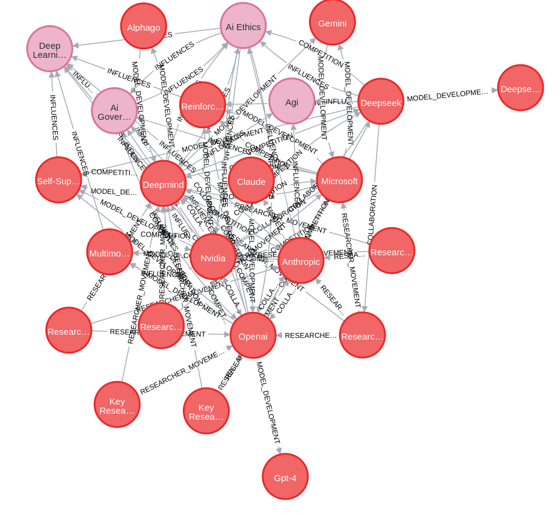
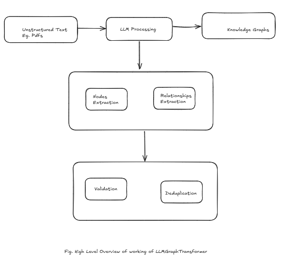
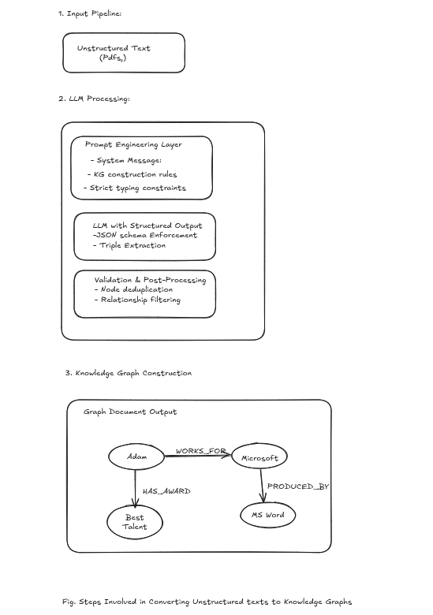

# knowledge-graphs
# 🧠 Knowledge Graph from PDF using LangChain and Neo4j

This repository contains a Jupyter Notebook that demonstrates how to transform a PDF document into a **Knowledge Graph** stored in a **Neo4j** database using **LangChain**, **OpenAI embeddings**, and **LLMGraphTransformer**.

## 📜 Steps Involved

1. **Load PDF**: Using `PyPDFLoader` from `langchain.document_loaders`.
2. **Semantic Chunking**: Split and embed the document chunks using `OpenAIEmbeddings`.
3. **Graph Construction**: Use `LLMGraphTransformer` to convert document chunks into nodes and relationships.
4. **Store in Neo4j**: Push the generated nodes and edges into a running Neo4j instance.
5. **Natural Language Querying**: Query the graph using `GraphCypherQAChain` which translates natural language to Cypher queries.

## 🛠️ Requirements

- Python 3.9+
- `langchain`
- `openai`
- `neo4j`
- `pypdf`
- `python-dotenv`
- `langchain_community` (for compatibility with latest LangChain versions)

You can install the requirements with:

```bash
pip install -r requirements.txt
```

## Snapshot of the Knowledge graph constructed in Neo4j



## Above Notebook relies on LLMGraphTransformer to construct the knowledge graph. Here is how LLMGraphTransformer works under the hood.



## DeepDive 



